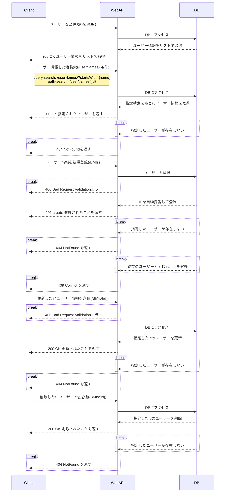

# boxinglist

```mermaid
sequenceDiagram
    Client ->> WebAPI: ユーザーを全件取得(/BMIs)
    WebAPI ->> DB: DBにアクセス
    DB -->> WebAPI: ユーザー情報をリストで取得
    WebAPI -->> Client: 200 OK ユーザー情報をリストで取得
    Client ->> WebAPI: ユーザー情報を指定検索(/userNames/{条件})
    participant Client
    Note right of Client: query-search: /userNames/?startsWith={name} <br> path-search: /userNames/{id}
    WebAPI ->> DB: DBにアクセス
    DB -->> WebAPI: 指定検索をもとにユーザー情報を取得
    WebAPI -->> Client: 200 OK 指定されたユーザーを返す
    break
        DB -->> WebAPI: 指定したユーザーが存在しない
    end
    break
        WebAPI -->> Client: 404 NotFoundを返す
    end

    Client ->> WebAPI: ユーザー情報を新規登録(/BMIs)
    WebAPI ->> DB: ユーザーを登録
    break
        WebAPI -->> Client: 400 Bad Request Validationエラー
    end
    DB -->> WebAPI: IDを自動採番して登録
    WebAPI -->> Client: 201 create 登録されたことを返す
    break
        DB -->> WebAPI: 指定したユーザーが存在しない
    end
    break
        WebAPI -->> Client: 404 NotFound を返す
    end
    break
        DB -->> WebAPI: 既存のユーザーと同じ name を登録
    end
    break
        WebAPI -->> Client: 409 Conflict を返す
    end
    Client ->> WebAPI: 更新したいユーザー情報を送信(/BMIs/{id})
    break
        WebAPI -->> Client: 400 Bad Request Validationエラー
    end
    WebAPI ->> DB: DBにアクセス
    DB -->> WebAPI: 指定したidのユーザーを更新
    WebAPI -->> Client: 200 OK 更新されたことを返す
    break
        DB -->> WebAPI: 指定したユーザーが存在しない
    end
    break
        WebAPI -->> Client: 404 NotFound を返す
    end

    Client ->> WebAPI: 削除したいユーザーidを送信(/BMIs/{id})
    WebAPI ->> DB: DBにアクセス
    DB -->> WebAPI: 指定したidのユーザーを削除
    WebAPI -->> Client: 200 OK 削除されたことを返す
    break
        DB -->> WebAPI: 指定したユーザーが存在しない
    end
    break
        WebAPI -->> Client: 404 NotFound を返す
    end
```
